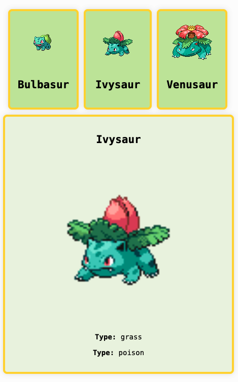

# Master INESDI 2025 

## Example: Var isn't enough for React State.

The need of `React.useState()`



```jsx
export function Pokedex() {
  let currentPokemon = data[1];
  return (
    <main>
      <PokemonList
        pkmns={data}
        onClick={(id) => {
          console.log(id);
          currentPokemon = data.find((pkmn) => pkmn.id === id);
        }}
      />
      <PokemonDetail pkmn={currentPokemon} />
    </main>
  );
}
```

***

```bash
git clone https://github.com/manuartero/master-inesdi-2024-var-isnt-enough-for-react-state
cd master-inesdi-2024-var-isnt-enough-for-react-state
npm i && npm run dev
```
